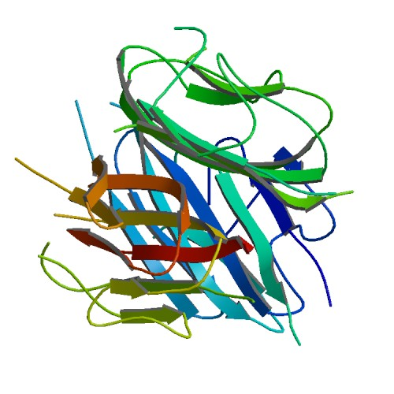

```{r setup, include=FALSE}
knitr::opts_chunk$set(echo = FALSE)
```




# Background:

Metabolic syndrome (MetS) is characterized by systemic disturbances that increase cardiovascular risk. Adiponectin (Ad) exhibits a cardioprotective function because of its anti-inflammatory and anti-atherosclerotic properties. In the bloodstream, this adipocytokine circulates on multimers (Admer), among which high molecular weight (HMW) are the most active forms. Because alterations of Ad plasmatic levels, Admer distribution and receptor (AdipoR) expression have been described in murine models and obese patients, strategies that aim to enhance Ad production or its effect on target tissues are the subject of intense investigations. While exercise training is well known to be beneficial for reducing cardiovascular risk, the contribution of Ad is still controversial. 

# Methods:

At 6 weeks of age, mice were submitted to a standard (SF) or high-fat high-sugar (HF) diet for 10 weeks. After 2 weeks, the SF- and HF-fed animals were randomly assigned to a training program (SFT, HFT) or not (SFC, HFC). The trained groups were submitted to sessions of running on a treadmill 5 days a week.

# Results and conclusions: 

The HF mice presented the key problems associated with MetS (increased caloric intake, body weight, glycemia and fat mass), a change in Admer distribution in favor of the less-active forms and increased AdipoR2 expression in muscle. In contrast, exercise training reversed some of the adverse effects of a HF diet (increased glucose tolerance, better caloric intake control) without any modifications in Ad production and Admer distribution. However, increased AdipoR1 muscle expression was observed in trained mice, but this effect was hampered by HF diet. These data corroborate a recent hypothesis suggesting a functional divergence between AdipoR1 and AdipoR2, with AdipoR1 having the predominant protective action on metabolic function.

# Vocabulary: 

| Words from the text | Synonym in English |
| ------------------- | ------------------ |
| Hamper              | Clog               |
| controversial       | contentious        |
|                     |                    |

# Analysis table

| Researchers   | Pierard M, Conotte S, Tassin A, Boutry S, Uzureau P, Boudjeltia KZ, Legrand A |
| ------------- | ----------------------------------------------------------------------------- |
| Published in? | November 3, 2016                                                              |
| Keywords      | Animal model; Differential regulation; Metabolic syndrome; Multimer; Obesity  |
|               |                                                                               |

